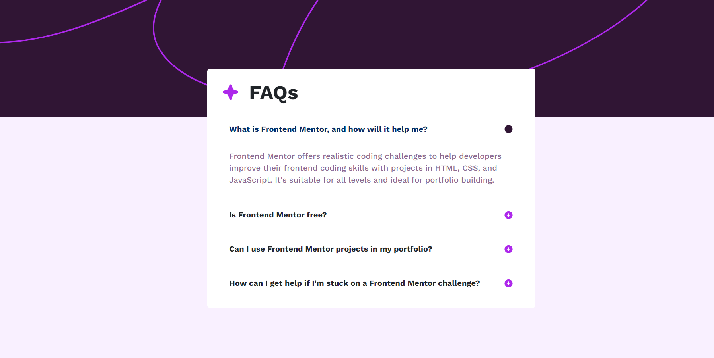

# Frontend Mentor - FAQ accordion solution

This is a solution to the [FAQ accordion challenge on Frontend Mentor](https://www.frontendmentor.io/challenges/faq-accordion-wyfFdeBwBz). Frontend Mentor challenges help you improve your coding skills by building realistic projects.

## Table of contents

- [Overview](#overview)
  - [The challenge](#the-challenge)
  - [Screenshot](#screenshot)
  - [Links](#links)
- [My process](#my-process)
  - [Built with](#built-with)
  - [What I learned](#what-i-learned)
  - [Continued development](#continued-development)
  - [Useful resources](#useful-resources)
- [Author](#author)
- [Acknowledgments](#acknowledgments)

## Overview

### The challenge

Users should be able to:

- Hide/Show the answer to a question when the question is clicked
- Navigate the questions and hide/show answers using keyboard navigation alone
- View the optimal layout for the interface depending on their device's screen size
- See hover and focus states for all interactive elements on the page

### Screenshot



### Links

- Solution URL: [Add solution URL here](https://your-solution-url.com)
- Live Site URL: [Add live site URL here](https://your-live-site-url.com)

## My process

### Built with

- Semantic HTML5 markup
- CSS custom properties
- Flexbox
- CSS Grid
- Bootstrap

### What I learned

```html
<div class="container pos">
  <div class="row">
    <div class="box rounded col-sm-6 m-5 p-4 mx-auto">
      <div class="title">
        <div class="star">
          
        </div>
      </div>
    </div>
  </div>
</div>
```

```css
.accordion-button:not(.collapsed)::after {
  background-image: url(./assets/images/icon-minus.svg);
}
.accordion-button::after {
  background-image: url(./assets/images/icon-plus.svg);
}
.accordion-button {
  --bs-accordion-btn-focus-box-shadow: none;
  --bs-accordion-btn-bg: white;
  --bs-accordion-active-bg: white;
}
```

### Continued development

Still I need the development at the side of responsiveness and I have to get well versed with the Bootstrap and React

### Useful resources

- [Example resource 1](https://getbootstrap.com/docs/5.3/layout/breakpoints/) - This helped me for responsiveness. I really liked this Bootstrap documentation and will use it going forward.

## Author

- Website - [Sathish Kumar](https://www.your-site.com)
- Frontend Mentor - [@SathishKumar-2004](https://www.frontendmentor.io/profile/SathishKumar-2004)
- LinkedIn - [Sathish Kumar](https://www.linkedin.com/in/sathish-kumar2004/)

## Acknowledgments

I would like to thank Frontend Mentor for providing such a great platform for developers to hone their skills and share their solutions with the community.
